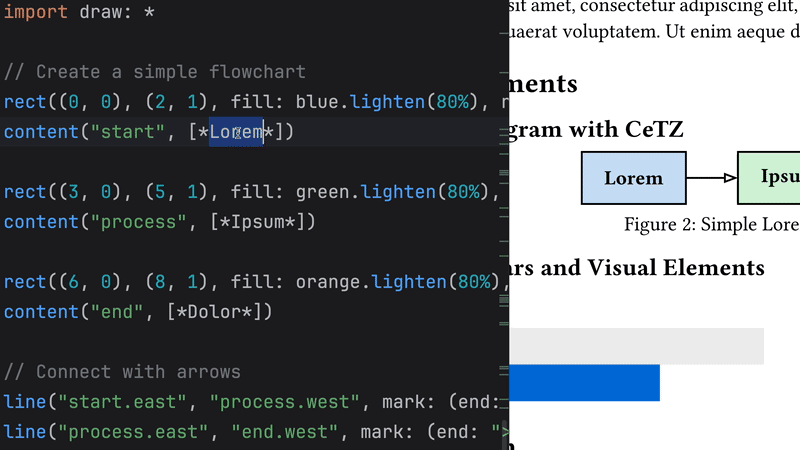
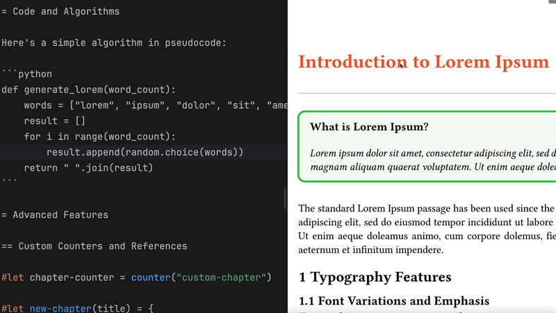
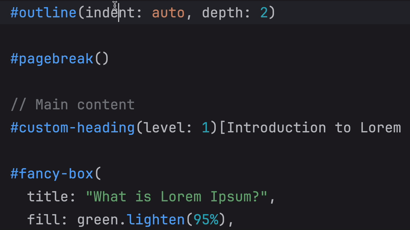
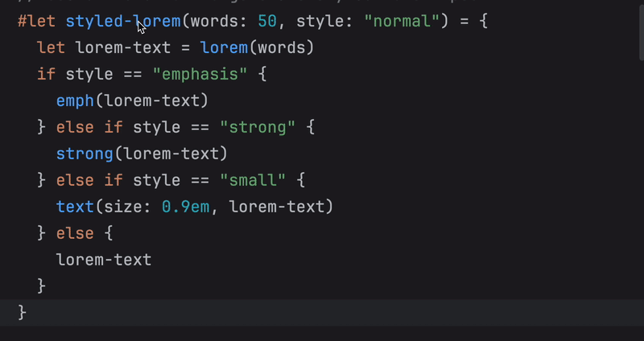
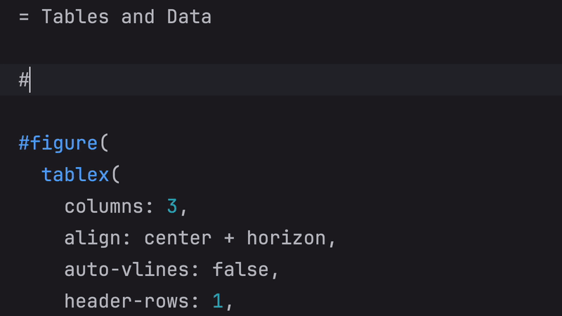
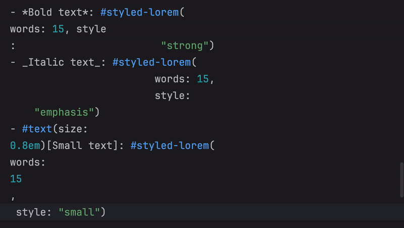
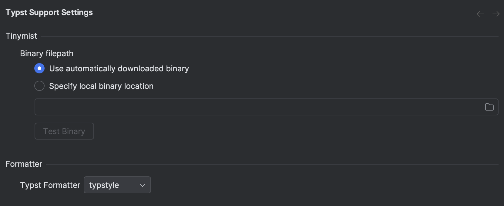

  

####

<!-- Plugin description -->

  <h3>An IntelliJ Plugin for Typst powered by Tinymist</h3>

## Features

- Live Preview
- Jump to Definition from Preview
- Documentation on Hover
- Find Usages
- Autocomplete
- Reformat files
- Bring your own binary
- ...and many more!

<!-- Plugin description end -->

# Feature Demos

<h3>Live Preview</h3>
Changes to documents are updated in the preview window in real time.

####

  

####

<h3>Jump to Definition from Preview</h3>
Click on a part of the preview document to jump to the definition of that element in the file.

####

  

####

<h3>Documentation on Hover</h3>
Hover over a symbol to view its documentation.

####

  

####

<h3>Find Usages</h3>
List all the places a symbol is used in the project.

####

  

####

<h3>Autocomplete</h3>
Suggestions for symbols as you type.

####

  

####

<h3>Reformat files</h3>
Reformat entire files with `typstfmt` or `typstyle`.

####

  

####

<h3>Bring your own binary!</h3>
Specify your local version of `tinymist` to be used with this plugin.

####

  

## Installation

- Using IDE built-in plugin system:

  <kbd>Settings/Preferences</kbd> > <kbd>Plugins</kbd> > <kbd>Marketplace</kbd> > <kbd>Search for "Typst
  Support"</kbd> >
  <kbd>Install Plugin</kbd>

## Compatible IDEs

Works in 2025.1+ IntelliJ IDEs.

## Feature Support

IntelliJ supports [the following LSP features out of the box](https://plugins.jetbrains.com/docs/intellij/language-server-protocol.html#supported-features). This plugin will improve as IntelliJ support for LSP features improves. In the meantime, we may be able to integrate unsupported LSP features into this plugin manually, with a view to removing them when official support arrives.
